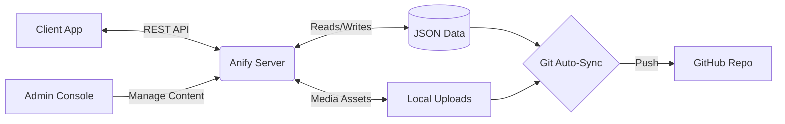
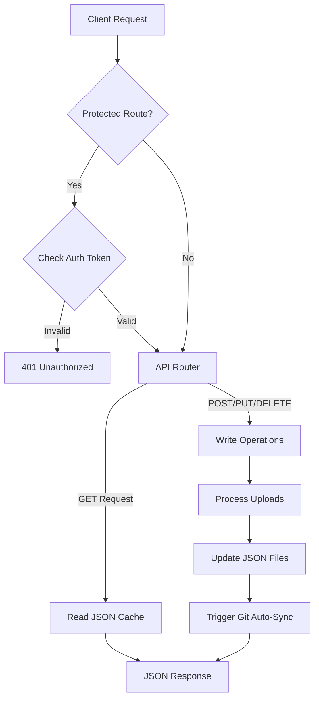
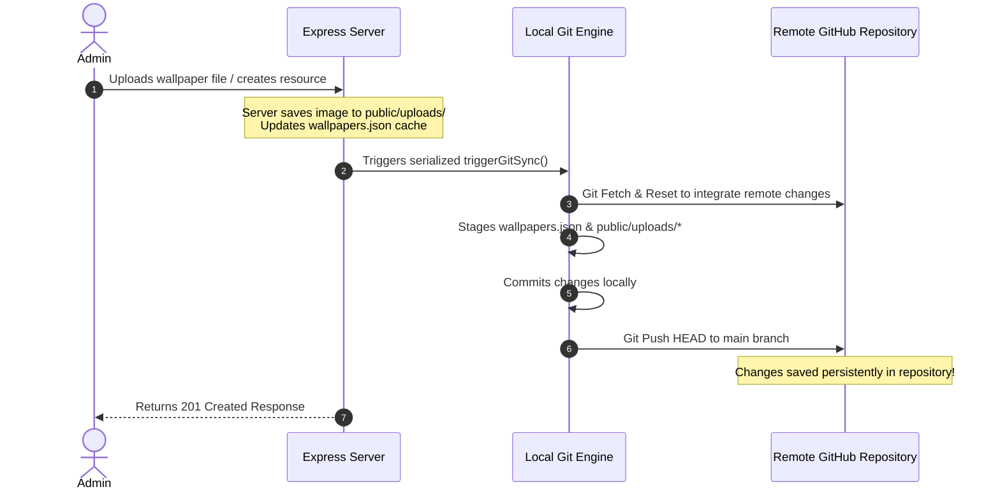
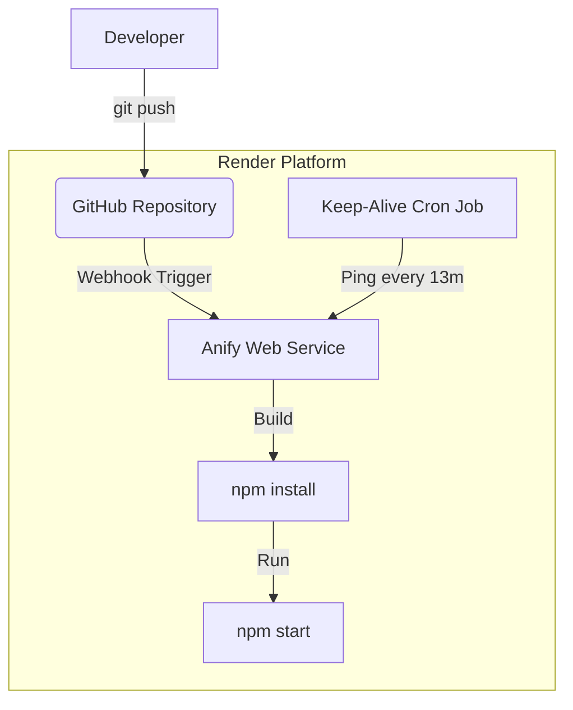

# Anify Wallpaper API Server

[](https://nodejs.org/)
[](https://expressjs.com/)
[](LICENSE)
[](#)

Anify Wallpaper API Server is a high-performance REST API backend and interactive management console designed to power personalization applications (such as the Anify Android app). It serves high-quality static wallpapers, live (video) wallpapers, and audio ringtones with zero-database configuration overhead, utilizing optimized JSON flat-file storage and self-healing caches.

---

## 📖 Table of Contents

- [What the Project Does](#-what-the-project-does)
- [Why the Project is Useful](#-why-the-project-is-useful)
- [How Users Can Get Started](#-how-users-can-get-started)
  - [Prerequisites](#prerequisites)
  - [Installation](#installation)
  - [Environment Configuration](#environment-configuration)
  - [Running the Server](#running-the-server)
  - [Running Tests](#running-tests)
- [🛠️ REST API Reference](#️-rest-api-reference)
  - [Wallpaper Endpoints](#wallpaper-endpoints)
  - [Live Wallpaper Endpoints](#live-wallpaper-endpoints)
  - [Ringtone Endpoints](#ringtone-endpoints)
  - [Authentication](#authentication)
- [🔄 Git Auto-Sync Workflow](#-git-auto-sync-workflow)
- [🚀 Deployment](#-deployment)
- [🤝 Contributing & Support](#-contributing--support)

---

## 🔍 What the Project Does

The Anify Server functions as a centralized content server and management dashboard. It delivers metadata and media assets via a robust REST API while providing a beautiful, browser-based **Explorer & Admin Dashboard** at the root domain (`http://localhost:3000/`).

Key capabilities include:
- **API Engine**: Delivers JSON payloads with advanced searching, sorting, pagination, and random selection routes.
- **Admin Console**: Offers a secure browser portal to upload new assets (supporting drag-and-drop or remote URL registration), update entries, and remove items.
- **Media Optimization**: Supports static image uploads, live video (MP4/WebM) files with optional preview thumbnails, and audio ringtones (MP3/WAV).

---

## 🏗️ System Architecture



---

## ✨ Why the Project is Useful

- **Zero-DB Simplicity**: Uses JSON flat-file databases ([wallpapers.json](file:///h:/Github/Anify_Server/wallpapers.json), [livewalls.json](file:///h:/Github/Anify_Server/livewalls.json), and [ringtones.json](file:///h:/Github/Anify_Server/ringtones.json)) initialized automatically upon launch. No complex databases (MySQL, MongoDB) are required.
- **Self-Healing Integrity**: On startup, database utilities scan JSON cache files to remove duplicates, standardize dimensions/properties, and generate deterministic MD5 IDs for items with missing identifiers.
- **Git Auto-Sync Backup**: Integrates a Git utility that automatically commits and pushes updated data files and local uploads (in `public/uploads`) back to your GitHub repository whenever changes are made in the admin panel.
- **Serverless/Ephemeral Friendly**: Designed to work perfectly on ephemeral cloud services (like Render, Heroku, or railway) by committing file uploads and state modifications back to source control instantly.
- **Premium Admin UI**: Out-of-the-box responsive dashboard serving toast alerts, interactive audio players, video preview lightboxes, and a live REST API test console.

---

## 🚀 How Users Can Get Started

### Prerequisites

Ensure you have the following installed on your machine:
- **Node.js**: `v18.0.0` or higher (tested on Node LTS)
- **npm**: `v9.0.0` or higher
- **Git**: Installed and available in the system path (required if `AUTO_GIT_SYNC` is enabled)

### Installation

1. Clone the repository to your local system:
   ```bash
   git clone https://github.com/satyakiran29/Anify_Server.git
   cd Anify_Server
   ```

2. Install the package dependencies:
   ```bash
   npm install
   ```

### Environment Configuration

Copy the sample environment variables or create a `.env` file in the root directory:

```env
PORT=3000
NODE_ENV=production
API_PREFIX=/api/v1
ADMIN_PASSWORD=admin123

# Git Auto-Sync (Optional)
AUTO_GIT_SYNC=true
GITHUB_TOKEN=your_github_personal_access_token
GITHUB_REPO=satyakiran29/Anify_Server
GITHUB_BRANCH=main
```

#### Environment Variables Description

| Variable | Description | Default |
| :--- | :--- | :--- |
| `PORT` | The port the Express application server will listen on. | `3000` |
| `NODE_ENV` | Running environment mode (`development` or `production`). | `production` |
| `API_PREFIX` | Base URI prefix for registering REST API routes. | `/api/v1` |
| `ADMIN_PASSWORD` | Security credential used to generate authentication sessions. | `admin123` |
| `AUTO_GIT_SYNC` | Enables auto-committing local db files and uploads back to Git. | `true` |
| `GITHUB_TOKEN` | A personal access token (PAT) with write access to target repo. | *Optional* |
| `GITHUB_REPO` | Git target repository in formatting `owner/repository`. | *Optional* |
| `GITHUB_BRANCH` | Remote branch targeted for commits and pushes. | `main` |

---

### Running the Server

#### Development Mode (with hot-reloading)
Runs the server with Node's native file-watching capability:
```bash
npm run dev
```

#### Production Mode
Launches the server in a optimized production environment:
```bash
npm start
```

Upon launching, the console outputs:
```text
===================================================
 Anify Wallpaper API Server is active!
 Port: 3000
 Environment: production
 API Endpoint: http://localhost:3000/api/v1/wallpapers
 Explorer Dashboard: http://localhost:3000
===================================================
```

---

### Running Tests

The server uses Node's native test runner. Execute the test suite with:
```bash
npm test
```

---

## 🛠️ REST API Reference



All requests follow the standardized format `/api/v1/{resource}`. Below is an overview of the key endpoints.

### Wallpaper Endpoints

| Method | Endpoint | Access | Description |
| :--- | :--- | :--- | :--- |
| **GET** | `/api/v1/wallpapers` | Public | Returns paginated list of wallpapers. Query parameters: `page`, `limit`, `search`, `category`, `sort` (e.g., `sort=name`). |
| **GET** | `/api/v1/wallpapers/random` | Public | Returns one or more random wallpapers. Query parameters: `limit` (max random items count), `category`. |
| **GET** | `/api/v1/wallpapers/categories` | Public | Returns a list of unique categories and wallpaper counts in each category. |
| **GET** | `/api/v1/wallpapers/stats` | Public | Returns database counts and active server uptime metric. |
| **GET** | `/api/v1/wallpapers/:id` | Public | Returns details of a specific wallpaper by its unique ID. |
| **POST** | `/api/v1/wallpapers` | Admin | Upload up to 50 wallpapers (using `image` form-data array field) or register an external wallpaper URL. |
| **PUT** | `/api/v1/wallpapers/:id` | Admin | Update details of a wallpaper (allows replacing image file via `image` field). |
| **DELETE** | `/api/v1/wallpapers/:id` | Admin | Remove a wallpaper and delete its local asset file from disk. |

### Live Wallpaper Endpoints

| Method | Endpoint | Access | Description |
| :--- | :--- | :--- | :--- |
| **GET** | `/api/v1/livewalls` | Public | Returns paginated list of live wallpapers. Query parameters: `page`, `limit`, `search`, `category`, `sort`. |
| **GET** | `/api/v1/livewalls/random` | Public | Returns random live wallpapers. Query parameters: `limit`, `category`. |
| **GET** | `/api/v1/livewalls/categories` | Public | Returns categories and counts. |
| **GET** | `/api/v1/livewalls/stats` | Public | Returns live database counts and statistics. |
| **GET** | `/api/v1/livewalls/:id` | Public | Returns details of a specific live wallpaper. |
| **POST** | `/api/v1/livewalls` | Admin | Upload live wallpaper. Supports multipart fields: `video` (video file) and `thumbnail` (preview image). |
| **PUT** | `/api/v1/livewalls/:id` | Admin | Update live wallpaper fields and replace video or thumbnail. |
| **DELETE** | `/api/v1/livewalls/:id` | Admin | Remove live wallpaper and delete associated disk assets. |

### Ringtone Endpoints

| Method | Endpoint | Access | Description |
| :--- | :--- | :--- | :--- |
| **GET** | `/api/v1/ringtones` | Public | Returns paginated list of audio ringtones. Query parameters: `page`, `limit`, `search`, `sort`. |
| **GET** | `/api/v1/ringtones/random` | Public | Returns random ringtones. Query parameters: `limit`. |
| **GET** | `/api/v1/ringtones/stats` | Public | Returns ringtone database statistics. |
| **GET** | `/api/v1/ringtones/:id` | Public | Returns details of a specific ringtone. |
| **POST** | `/api/v1/ringtones` | Admin | Upload up to 50 audio tracks (using `audio` form-data array field) or register an external audio URL. |
| **PUT** | `/api/v1/ringtones/:id` | Admin | Update ringtone details and duration properties. |
| **DELETE** | `/api/v1/ringtones/:id` | Admin | Remove ringtone and clean up its local file from disk. |

### KWGT Endpoints

| Method | Endpoint | Access | Description |
| :--- | :--- | :--- | :--- |
| **GET** | `/api/v1/kwgts` | Public | Returns paginated list of KWGT widgets. Query parameters: `page`, `limit`, `search`, `category`, `sort`. |
| **GET** | `/api/v1/kwgts/random` | Public | Returns random KWGT widgets. Query parameters: `limit`, `category`. |
| **GET** | `/api/v1/kwgts/categories` | Public | Returns KWGT categories and counts. |
| **GET** | `/api/v1/kwgts/stats` | Public | Returns KWGT database statistics. |
| **GET** | `/api/v1/kwgts/:id` | Public | Returns details of a specific KWGT widget. |
| **POST** | `/api/v1/kwgts` | Admin | Upload KWGT widget files. Supports multipart fields: `file` (.kwgt file) and `thumbnail` (preview image). |
| **PUT** | `/api/v1/kwgts/:id` | Admin | Update KWGT details and replace file or thumbnail. |
| **DELETE** | `/api/v1/kwgts/:id` | Admin | Remove KWGT widget and delete associated disk assets. |

---

### Authentication

To authenticate with protected Admin endpoints:

1. Send a **POST** request to `/api/v1/wallpapers/auth/login` with the body:
   ```json
   {
     "password": "your_configured_admin_password"
   }
   ```
2. The server responds with a SHA256 hashed authentication token:
   ```json
   {
     "status": "success",
     "message": "Login successful.",
     "data": {
       "token": "a1c2...e8f9"
     }
   }
   ```
3. Attach this token to the `Authorization` header on all write requests:
   ```text
   Authorization: Bearer <token>
   ```

---

## 🔄 Git Auto-Sync Workflow

When running on hosting providers with ephemeral filesystems (e.g. Render, where files uploaded to disk are lost after restart), the **Auto-Sync** feature ensures persistence by turning the source repository into the database storage backend.



*Note: The auto-sync process uses a queueing mechanism to prevent concurrent Git execution locks when multiple uploads are triggered consecutively.*

---

## 🚀 Deployment

The project is configured for seamless deployment on **Render** using the provided [render.yaml](file:///h:/Github/Anify_Server/render.yaml) file:

1. Connect your GitHub repository to **Render**.
2. Deploy the blueprint specification.
3. Configure the following environment secrets in your Render Web Service dashboard:
   - `ADMIN_PASSWORD` (Your private management password)
   - `GITHUB_TOKEN` (Personal Access Token with write permissions to your repo)

The blueprint automatically spins up:
- A Web Service for the Express.js server (`anify-server`).
- A Cron Job (`anify-keep-alive`) running every 13 minutes to ping the stats endpoint and prevent the web service from sleeping (Render spins down free services after 15 minutes of inactivity).



---

## 🤝 Contributing & Support

- **Bugs & Features**: If you find an issue or want to request a feature, please open an issue in the GitHub issue tracker.
- **How to Help**: Feel free to submit pull requests for code optimizations, frontend design enhancements, or CLI script improvements. Refer to the project's [package.json](file:///h:/Github/Anify_Server/package.json) for the active dependency manifest.
- **Contact**: Reach out to the maintainer at the GitHub repository homepage: [satyakiran29/Anify_Server](https://github.com/satyakiran29/Anify_Server).
