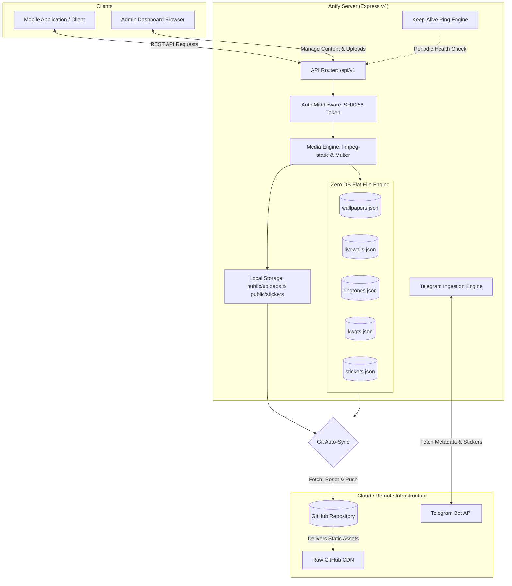
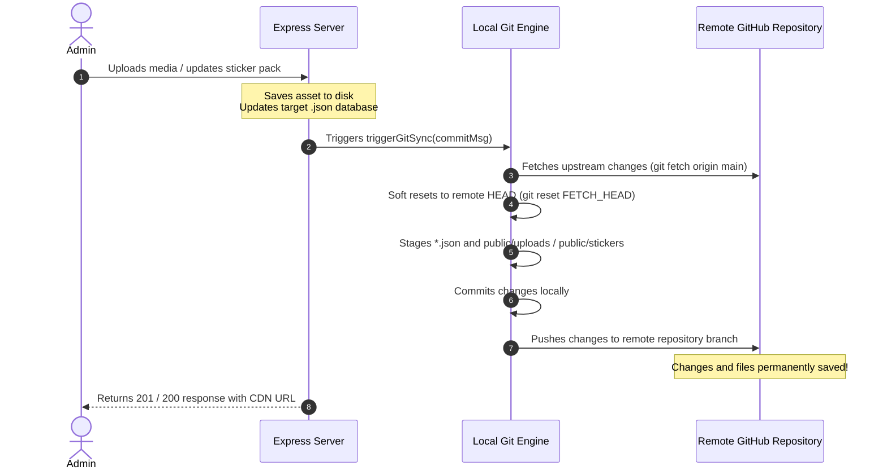
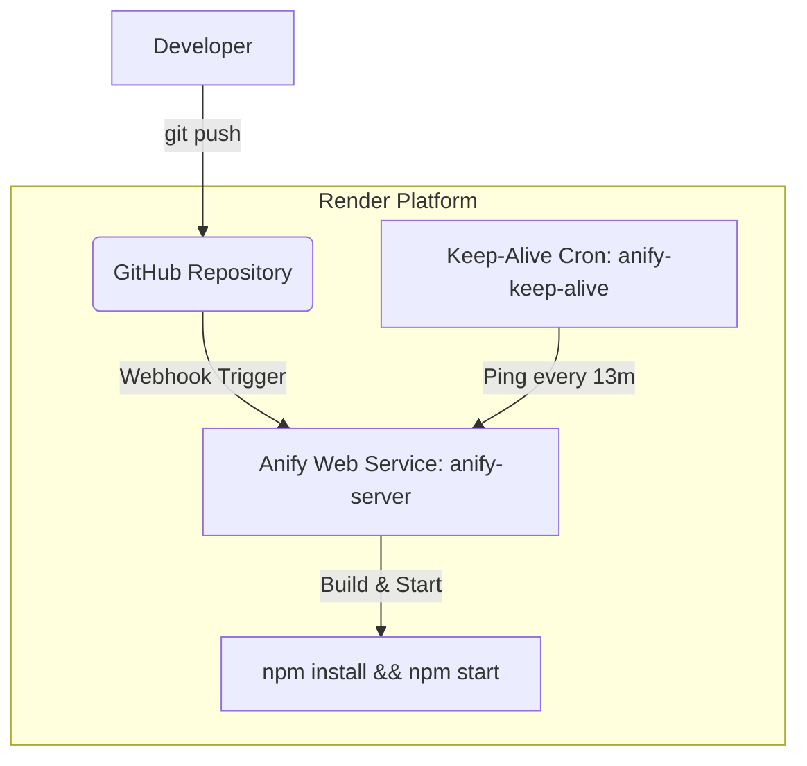

# Anify Server

[](https://play.google.com/store/apps/details?id=com.skdev.anify)
[](https://anify.psatyakiran.in/)
[](https://nodejs.org/)
[](https://expressjs.com/)
[](LICENSE)
[](#)
[](https://github.com/satyakiran29/Anify_Server/pulls)

**Anify Server** is a high-performance REST API backend and interactive administration console built to power Android personalization applications — notably the official **[Anify Android App on Google Play](https://play.google.com/store/apps/details?id=com.skdev.anify)** and the **[Anify Web Experience](https://anify.psatyakiran.in/)**. It serves curated static wallpapers, live (video) wallpapers, audio ringtones, KWGT widget presets, and Telegram sticker packs with zero-database overhead using high-speed JSON flat-file storage, automated media conversion, self-healing caches, and continuous Git synchronization.

---

## 📖 Table of Contents

- [🔍 What the Project Does](#-what-the-project-does)
- [🏗️ System Architecture](#️-system-architecture)
- [✨ Key Features & Capabilities](#-key-features--capabilities)
- [🚀 Getting Started](#-getting-started)
  - [Prerequisites](#prerequisites)
  - [Installation](#installation)
  - [Environment Configuration](#environment-configuration)
  - [Running the Server](#running-the-server)
  - [Running Tests](#running-tests)
- [🛠️ REST API Reference](#️-rest-api-reference)
  - [Authentication](#authentication)
  - [Wallpaper Endpoints (`/api/v1/wallpapers`)](#wallpaper-endpoints)
  - [Live Wallpaper Endpoints (`/api/v1/livewalls`)](#live-wallpaper-endpoints)
  - [Ringtone Endpoints (`/api/v1/ringtones`)](#ringtone-endpoints)
  - [KWGT Widget Endpoints (`/api/v1/kwgts`)](#kwgt-widget-endpoints)
  - [Sticker Pack Endpoints (`/api/v1/stickers`)](#sticker-pack-endpoints)
- [🔄 Git Auto-Sync & Storage Engine](#-git-auto-sync--storage-engine)
- [🎭 Telegram Integration & WebP Media Engine](#-telegram-integration--webp-media-engine)
- [⏱️ Keep-Alive & Self-Healing Architecture](#️-keep-alive--self-healing-architecture)
- [📂 Project Directory Structure](#-project-directory-structure)
- [🚀 Deployment](#-deployment)
- [🤝 Contributing & Support](#-contributing--support)

---

## 🔍 What the Project Does

The Anify Server functions as a unified content distribution engine and browser-based management portal. It delivers fast JSON payloads with full support for searching, filtering, category grouping, sorting, pagination, and random item selection across 5 personalization categories:

1. 🖼️ **Static Wallpapers**: Ultra-HD wallpaper images with automatic dimension resolution and metadata extraction.
2. 🎬 **Live Wallpapers**: Video wallpapers (MP4/WebM) paired with instant thumbnail previews.
3. 🎵 **Audio Ringtones**: High-bitrate audio clips (MP3/WAV/AAC) with duration metrics.
4. 📱 **KWGT Widgets**: KWGT preset archive files (`.kwgt`) with bundled preview imagery.
5. 🎭 **Sticker Packs**: Telegram sticker pack catalog with automated metadata ingestion and WebM-to-WebP conversion.

At the root address (`http://localhost:3000/`), the server provides an **Explorer & Admin Dashboard** equipped with real-time media previews, batch file uploading, resource management, and an interactive REST API testing suite.

---

## 🏗️ System Architecture



---

## ✨ Key Features & Capabilities

- **Zero-DB Simplicity**: No SQL database or MongoDB setup required. Uses lightweight JSON databases ([wallpapers.json](file:///h:/Github/Anify_Server/wallpapers.json), [livewalls.json](file:///h:/Github/Anify_Server/livewalls.json), [ringtones.json](file:///h:/Github/Anify_Server/ringtones.json), [kwgts.json](file:///h:/Github/Anify_Server/kwgts.json), [stickers.json](file:///h:/Github/Anify_Server/stickers.json)) initialized and verified automatically on boot.
- **Automated Telegram Sticker Ingestion**: Provide a Telegram sticker pack URL or slug, and the server fetches the title, sticker count, animation flags, and sticker preview assets automatically.
- **WebM-to-WebP Frame Extraction**: Leverages `ffmpeg-static` to convert animated video stickers (`.webm`) and images into standardized `.webp` previews on the fly.
- **Git Auto-Sync Persistence**: Solves ephemeral cloud filesystem constraints (e.g. Render, Railway, Heroku) by automatically staging, committing, and pushing updated JSON databases and newly uploaded media assets directly back to your GitHub repository.
- **CDN Acceleration**: Converts uploaded media links into permanent `raw.githubusercontent.com` URLs for zero-cost, high-speed static asset distribution.
- **Self-Healing Database Engine**: Deduplicates entries, fixes missing attributes, standardizes dimensions, and generates deterministic MD5 identifiers automatically on startup.
- **Built-in Self-Ping / Keep-Alive**: Prevents free hosting instances from sleeping by dispatching self-pings at regular intervals.
- **Interactive Administration Dashboard**: Built-in glassmorphic web dashboard with media audio players, video lightboxes, category browsers, drag-and-drop file uploaders, and live API exploration tools.

---

## 🚀 Getting Started

### Prerequisites

- **Node.js**: `v18.0.0` or higher
- **npm**: `v9.0.0` or higher
- **Git**: Installed and accessible in your system `PATH` (required when `AUTO_GIT_SYNC=true`)

### Installation

1. Clone the repository:
   ```bash
   git clone https://github.com/satyakiran29/Anify_Server.git
   cd Anify_Server
   ```

2. Install dependencies:
   ```bash
   npm install
   ```

### Environment Configuration

Create a `.env` file in the root directory (or configure these in your cloud hosting environment):

```env
PORT=3000
NODE_ENV=production
API_PREFIX=/api/v1
ADMIN_PASSWORD=admin123

# Git Auto-Sync Configuration (Optional / Recommended for Cloud)
AUTO_GIT_SYNC=true
GITHUB_TOKEN=your_github_personal_access_token
GITHUB_REPO=satyakiran29/Anify_Server
GITHUB_BRANCH=main

# Telegram Ingestion Bot Token (Optional - fallback provided)
TELEGRAM_BOT_TOKEN=your_telegram_bot_token

# Cloud URL for Keep-Alive Ping (Optional)
RENDER_EXTERNAL_URL=https://anify-server.onrender.com
```

#### Environment Variables Reference

| Variable | Description | Default |
| :--- | :--- | :--- |
| `PORT` | Port number for the HTTP server to listen on. | `3000` |
| `NODE_ENV` | Environment mode (`development` or `production`). | `production` |
| `API_PREFIX` | Prefix route for REST API endpoints. | `/api/v1` |
| `ADMIN_PASSWORD` | Passcode used to authenticate admin sessions. | `admin123` |
| `AUTO_GIT_SYNC` | Automatically commit and push local changes to GitHub. | `true` |
| `GITHUB_TOKEN` | GitHub Personal Access Token (PAT) with write repository permissions. | *None* |
| `GITHUB_REPO` | Target GitHub repository (`username/repository`). | `satyakiran29/Anify_Server` |
| `GITHUB_BRANCH` | Target branch for commits and pushes. | `main` |
| `TELEGRAM_BOT_TOKEN` | Telegram Bot token for querying sticker sets via Telegram API. | *Embedded Token* |
| `RENDER_EXTERNAL_URL` | App host URL used for self-pings to prevent container sleep. | *None* |

---

### Running the Server

#### Development Mode (with hot reloading)
```bash
npm run dev
```

#### Production Mode
```bash
npm start
```

Upon boot, the server logs startup metrics:
```text
===================================================
 Anify Server is active!
 Port: 3000
 Environment: production
 API Endpoint: http://localhost:3000/api/v1/wallpapers
 Stickers API: http://localhost:3000/api/v1/stickers
 Explorer Dashboard: http://localhost:3000
===================================================
```

---

### Running Tests

Execute the automated test suite using Node's native test runner:

```bash
# Run main API test suite
npm test

# Run all test specifications
node --test test/*.test.js
```

---

## 🛠️ REST API Reference

All requests follow the pattern `/api/v1/{resource}`.

### Authentication

Protected endpoints (`POST`, `PUT`, `DELETE`) require a Bearer token.

#### 1. Admin Login
- **Endpoint**: `POST /api/v1/wallpapers/auth/login`
- **Request Body**:
  ```json
  {
    "password": "your_configured_admin_password"
  }
  ```
- **Response**:
  ```json
  {
    "status": "success",
    "message": "Login successful.",
    "data": {
      "token": "7297e682e0b5a328574adad3cf97e20d..."
    }
  }
  ```

#### 2. Authorizing Requests
Pass the token in the `Authorization` header:
```text
Authorization: Bearer <token>
```

---

### Wallpaper Endpoints

**Base Path**: `/api/v1/wallpapers`

| Method | Endpoint | Access | Description |
| :--- | :--- | :--- | :--- |
| **GET** | `/` | Public | Paginated wallpaper list. Query parameters: `page`, `limit` (pass `0` for all), `search`, `category`, `sort` (e.g. `sort=name`). |
| **GET** | `/random` | Public | Returns random wallpapers. Query parameters: `limit` (default: 1), `category`. |
| **GET** | `/categories` | Public | Returns unique categories with wallpaper count per category. |
| **GET** | `/stats` | Public | Returns database counts, category totals, and server uptime. |
| **GET** | `/:id` | Public | Returns single wallpaper details by ID. |
| **POST** | `/` | Admin | Upload up to 50 wallpapers (`image` multipart form field) or register an external image URL. |
| **PUT** | `/:id` | Admin | Update wallpaper details or replace image file. |
| **DELETE** | `/:id` | Admin | Remove wallpaper and clean up associated disk file. |

#### Example Response (`GET /api/v1/wallpapers`):
```json
{
  "status": "success",
  "results": 1,
  "pagination": {
    "total": 289,
    "page": 1,
    "limit": 1,
    "pages": 289
  },
  "data": {
    "wallpapers": [
      {
        "id": "e605d54a2db6ab04cf3519808389659b",
        "name": "Neon Cyber City",
        "category": "Cyberpunk",
        "image": "https://raw.githubusercontent.com/satyakiran29/Anify_Server/main/public/uploads/wallpaper-1718000000.jpg",
        "dimensions": { "width": 2160, "height": 3840 },
        "size": "2.4 MB",
        "created_at": "2026-08-17T10:00:00.000Z"
      }
    ]
  }
}
```

---

### Live Wallpaper Endpoints

**Base Path**: `/api/v1/livewalls`

| Method | Endpoint | Access | Description |
| :--- | :--- | :--- | :--- |
| **GET** | `/` | Public | Paginated live video wallpapers. Query parameters: `page`, `limit`, `search`, `category`, `sort`. |
| **GET** | `/random` | Public | Returns random live wallpapers. Query parameters: `limit`, `category`. |
| **GET** | `/categories` | Public | Returns unique live wallpaper categories and counts. |
| **GET** | `/stats` | Public | Returns live wallpaper metrics and server uptime. |
| **GET** | `/:id` | Public | Returns specific live wallpaper details. |
| **POST** | `/` | Admin | Upload live video (`video` field) and optional preview thumbnail (`thumbnail` field) or submit URLs. |
| **PUT** | `/:id` | Admin | Update live wallpaper fields and replace video or thumbnail. |
| **DELETE** | `/:id` | Admin | Delete live wallpaper entry and associated disk assets. |

---

### Ringtone Endpoints

**Base Path**: `/api/v1/ringtones`

| Method | Endpoint | Access | Description |
| :--- | :--- | :--- | :--- |
| **GET** | `/` | Public | Paginated list of audio ringtones. Query parameters: `page`, `limit`, `search`, `sort`. |
| **GET** | `/random` | Public | Returns random ringtones. Query parameter: `limit`. |
| **GET** | `/stats` | Public | Returns total ringtones and database metrics. |
| **GET** | `/:id` | Public | Returns details of a single ringtone. |
| **POST** | `/` | Admin | Upload up to 50 audio tracks (`audio` multipart field) or register an external audio URL. |
| **PUT** | `/:id` | Admin | Update ringtone metadata and duration properties. |
| **DELETE** | `/:id` | Admin | Remove ringtone and delete local audio file. |

---

### KWGT Widget Endpoints

**Base Path**: `/api/v1/kwgts`

| Method | Endpoint | Access | Description |
| :--- | :--- | :--- | :--- |
| **GET** | `/` | Public | Paginated list of KWGT widgets. Query parameters: `page`, `limit`, `search`, `category`, `sort`. |
| **GET** | `/random` | Public | Returns random KWGT presets. Query parameters: `limit`, `category`. |
| **GET** | `/categories` | Public | Returns KWGT category list and counts. |
| **GET** | `/stats` | Public | Returns KWGT database metrics. |
| **GET** | `/:id` | Public | Returns details of a specific KWGT widget. |
| **POST** | `/` | Admin | Upload `.kwgt` files (`file` field) and preview image (`thumbnail` field). |
| **PUT** | `/:id` | Admin | Update KWGT entry and replace file or thumbnail. |
| **DELETE** | `/:id` | Admin | Remove KWGT preset and delete associated files from disk. |

---

### Sticker Pack Endpoints

**Base Path**: `/api/v1/stickers`

| Method | Endpoint | Access | Description |
| :--- | :--- | :--- | :--- |
| **GET** | `/` | Public | Paginated sticker pack list. Query parameters: `page`, `limit`, `search`, `category`, `sort` (`name`, `category`, `downloads`, `rating`). |
| **GET** | `/random` | Public | Returns random sticker packs. Query parameters: `limit`, `category`. |
| **GET** | `/categories` | Public | Returns categories, item counts, and category thumbnail icons. |
| **GET** | `/stats` | Public | Returns total packs, total individual stickers, categories, authors, and download counts. |
| **GET** | `/:id` | Public | Lookup a sticker pack by unique ID or slug identifier (e.g. `nekostickerpack120`). |
| **POST** | `/auto-fetch` | Public/Admin | Automatically queries Telegram Bot API for pack details, sticker counts, and generates converted `.webp` previews. |
| **POST** | `/` | Admin | Create a new sticker pack. Automatically converts preview links to `.webp` frames and computes sticker counts. |
| **PUT** | `/:id` | Admin | Update sticker pack metadata, tags, preview array, rating, or downloads. |
| **DELETE** | `/:id` | Admin | Remove sticker pack and delete local converted sticker files. |

#### Auto-Fetch Telegram Sticker Pack (`POST /api/v1/stickers/auto-fetch`):
**Request Body**:
```json
{
  "packNameOrUrl": "https://t.me/addstickers/nekostickerpack120"
}
```
**Response**:
```json
{
  "status": "success",
  "data": {
    "name": "Neko Pack 120",
    "identifier": "nekostickerpack120",
    "telegramUrl": "https://t.me/addstickers/nekostickerpack120",
    "totalStickers": 30,
    "animated": false,
    "thumbnail": "https://raw.githubusercontent.com/satyakiran29/Anify_Server/main/public/stickers/nekostickerpack120/thumbnail.webp",
    "previews": [
      "https://raw.githubusercontent.com/satyakiran29/Anify_Server/main/public/stickers/nekostickerpack120/preview_0.webp",
      "https://raw.githubusercontent.com/satyakiran29/Anify_Server/main/public/stickers/nekostickerpack120/preview_1.webp"
    ]
  }
}
```

---

## 🔄 Git Auto-Sync & Storage Engine

When hosted on platforms with ephemeral filesystems (like Render or Railway), files uploaded to the local disk are lost upon server restart or redeployment. The **Git Auto-Sync** engine guarantees zero data loss by treating your GitHub repository as the primary persistent database.



- **Serialized Execution**: Sync operations use a queueing mechanism to prevent concurrent Git lock conflicts.
- **Automatic Git User Configuration**: Sets fallback auto-sync credentials if running in a clean container without pre-configured Git globals.
- **CDN Raw URLs**: Generates `https://raw.githubusercontent.com/{repo}/{branch}/public/{path}` links for static files, providing seamless CDN delivery.

---

## 🎭 Telegram Integration & WebP Media Engine

Telegram provides animated and static sticker sets in `.webm` or `.tgs` formats. To guarantee maximum compatibility across mobile applications and browsers:

1. The server interfaces directly with the Telegram Bot API (`getStickerSet`, `getFile`).
2. Downloaded media passes through the `stickerConverter` module powered by `ffmpeg-static`.
3. Video stickers (`.webm`) have frame snapshots extracted and converted into lightweight, high-fidelity `.webp` images stored in `public/stickers/{slug}/`.
4. Pack previews and thumbnails are normalized and linked into `stickers.json`.

---

## ⏱️ Keep-Alive & Self-Healing Architecture

### Keep-Alive Mechanism
Free-tier hosting providers (e.g. Render) spin down inactive web services after 15 minutes. Anify Server implements dual protection:
1. **In-Process Interval Self-Ping**: If `RENDER_EXTERNAL_URL` is set, `src/server.js` automatically sends periodic HTTP pings every 10 minutes to `/api/v1/wallpapers/stats`.
2. **Scheduled Cron Worker**: [render.yaml](file:///h:/Github/Anify_Server/render.yaml) defines a companion cron service executing [src/scripts/keepAlive.js](file:///h:/Github/Anify_Server/src/scripts/keepAlive.js) every 13 minutes.

### Self-Healing Database Lifecycle
On server startup, each database utility ([db.js](file:///h:/Github/Anify_Server/src/utils/db.js), [liveDb.js](file:///h:/Github/Anify_Server/src/utils/liveDb.js), [ringtoneDb.js](file:///h:/Github/Anify_Server/src/utils/ringtoneDb.js), [kwgtDb.js](file:///h:/Github/Anify_Server/src/utils/kwgtDb.js), [stickerDb.js](file:///h:/Github/Anify_Server/src/utils/stickerDb.js)):
- Creates missing JSON files with empty array defaults if they do not exist.
- Validates entries and removes corrupted or duplicate records.
- Computes deterministic MD5 hashes for items lacking unique IDs.
- Creates required asset directories (`public/uploads`, `public/stickers`).

---

## 📂 Project Directory Structure

```text
Anify_Server/
├── public/                     # Static frontend files & uploaded media
│   ├── index.html              # Admin Console & API Explorer Dashboard UI
│   ├── app.js                  # Frontend interactive client application
│   ├── style.css               # Glassmorphic UI stylesheet
│   ├── stickers/               # Converted .webp sticker pack assets
│   └── uploads/                # Uploaded wallpapers, videos, ringtones, kwgts
├── src/
│   ├── controllers/            # Request handlers for all resources
│   │   ├── kwgtController.js
│   │   ├── livewallController.js
│   │   ├── ringtoneController.js
│   │   ├── stickerController.js
│   │   └── wallpaperController.js
│   ├── middleware/             # Express middlewares
│   │   ├── auth.js             # Token verification middleware
│   │   ├── errorHandler.js     # Centralized 404 & error handlers
│   │   ├── upload.js           # Multer wallpaper storage configuration
│   │   ├── uploadKwgt.js       # Multer KWGT file uploader
│   │   ├── uploadLive.js       # Multer live video/thumb uploader
│   │   └── uploadRingtone.js   # Multer audio uploader
│   ├── routes/                 # Express API routing tables
│   │   ├── kwgtRoutes.js
│   │   ├── livewallRoutes.js
│   │   ├── ringtoneRoutes.js
│   │   ├── stickerRoutes.js
│   │   └── wallpaperRoutes.js
│   ├── scripts/                # Utility scripts
│   │   └── keepAlive.js        # Health ping script for Render cron jobs
│   ├── utils/                  # Core helpers & database utilities
│   │   ├── db.js               # Wallpapers JSON database engine
│   │   ├── gitSync.js          # Git auto-commit and push synchronizer
│   │   ├── kwgtDb.js           # KWGT widgets database engine
│   │   ├── liveDb.js           # Live wallpapers database engine
│   │   ├── ringtoneDb.js       # Audio ringtones database engine
│   │   ├── stickerConverter.js # ffmpeg WebM-to-WebP frame extractor
│   │   └── stickerDb.js        # Sticker packs database engine
│   └── server.js               # Application entry point & server bootstrap
├── test/                       # Node.js automated test suites
│   ├── admin_delete.test.js
│   ├── api.test.js
│   ├── sticker.test.js
│   └── sticker_routes.test.js
├── kwgts.json                  # JSON flat-file database for KWGT presets
├── livewalls.json              # JSON flat-file database for Live wallpapers
├── ringtones.json              # JSON flat-file database for Audio ringtones
├── stickers.json               # JSON flat-file database for Sticker packs
├── wallpapers.json             # JSON flat-file database for Static wallpapers
├── render.yaml                 # Render cloud blueprint specification
└── package.json                # Project dependencies & npm scripts
```

---

## 🚀 Deployment

The repository includes a ready-to-deploy **Render Blueprint** configuration in [render.yaml](file:///h:/Github/Anify_Server/render.yaml).

### Steps to Deploy:
1. Fork or push this repository to your GitHub account.
2. Sign in to [Render](https://render.com/) and navigate to **Blueprints**.
3. Select your repository and deploy the blueprint.
4. Set the following environment secrets in your Render Web Service dashboard:
   - `ADMIN_PASSWORD` - Passcode for admin authentication.
   - `GITHUB_TOKEN` - Personal Access Token with repository write permissions.
   - `TELEGRAM_BOT_TOKEN` *(Optional)* - Custom bot token for sticker fetching.



---

## 🤝 Contributing & Support

Contributions, suggestions, and feature requests are welcome!

1. Fork the project repository.
2. Create your feature branch (`git checkout -b feature/amazing-feature`).
3. Commit your changes (`git commit -m 'feat: Add amazing feature'`).
4. Push to the branch (`git push origin feature/amazing-feature`).
5. Open a Pull Request.

### Issues & Inquiries
For bugs, questions, or feature requests, please open an issue in the [GitHub Issue Tracker](https://github.com/satyakiran29/Anify_Server/issues).

---

<div align="center">
  <p>
    <a href="https://play.google.com/store/apps/details?id=com.skdev.anify"><b>📱 Download on Google Play</b></a> &nbsp;•&nbsp;
    <a href="https://anify.psatyakiran.in/"><b>🌐 Visit Official Website</b></a> &nbsp;•&nbsp;
    <a href="https://github.com/satyakiran29/Anify_Server"><b>⭐ Star on GitHub</b></a>
  </p>
  <sub>Built with ❤️ by <a href="https://github.com/satyakiran29">Satyakiran</a> to power seamless mobile personalization.</sub>
</div>
